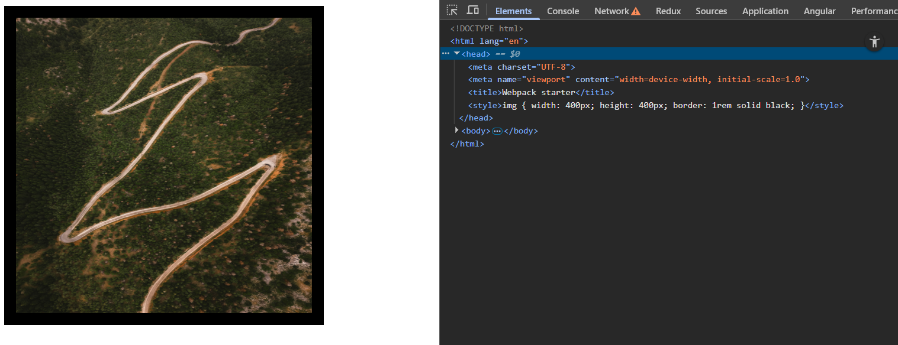

# WebpackStarter
A starter project to see webpack in action

1. Create a new npm project

        npm init
- Creates a project with only 1 file i.e package.json file.
- package.json files contains:
    - Dependencies used in our project
    - Scripts to build and execute our project

2. Create JS modules

- Create a `src` folder. This would segregate the core logic from other configuration/setup files.
- Create 2 JS files in that `src` folder: `index.js`, `sum.js`
- `index.js` will be using the functions from `sum.js` hence it is should be loaded first.
- Syntax to link JS files as per the module system:

    

3. Install and configure webpack

        npm install --save-dev webpack

- Install webpack for this project alone using the above command.
- Create a config file -> webpack.config.js 
    - File that lets us customize the behaviour of webpack
    - While running, webpack looks for a file with exact this name to fetch the custom configurations.
    - Webpack runs in node.js environment. Hence, we use a node.js helper function to fetch the absolute path for storing the output file.

4. Run webpack

- Create a script (build) in package.json file.
- Run this locally installed webpack

        npm run build

# Installing webpack globally: CONS

- Install using `npm install -g webpack`
    - Webpack gets installed globally on our system and is no longer confined to the current project.
- To run: `webpack`
    - Out of all the globally installed modules on our computer, the one called `webpack` will pe picked and run.
- However, when we install webpack just for a particular project and write a script to run it (as mentioned in the previous section), upon running that script:
    - Instead of checking the global node_modules directory our computer, npm will check the node_modules of our current project and run the `webpack` module present in it.
- When we install webpack globally, we can have only one version of it at a given time. If we want a project to be using webpack vX.0 and other one to be using vY.0, we should install it per project.

# Setting up Babel (One of the webpack's module loader)

1. Install required dependencies:

        npm install --save-dev babel-loader @babel/core @babel/preset-env

    - babel-loader -> Teaches babel how to work with webpack
    - @babel/core -> Facilitates taking in a code, parsing it and generating output files
    - @babel/preset-env -> Ruleset for telling babel exactly what pieces of ES6 (and above) syntax to look for and how to convert them into ES5 code

2. Create a .babelrc file to define presets

3. Add the babel loader configurations to the webpack.config.js file

**Note: In Babel v7, babel-core was renamed to @babel.core while babel-preset-env was renamed to @babel/preset-env**

# Loaders to help webpack deal with CSS files

        npm install --save-dev style-loader css-loader

1. css-loader -> Teaches webpack how to import and parse CSS files
2. style-loader -> Teaches webpack what to do with the content of the CSS file (i.e inject them to a style tag in HTML document in bundle.js)

    

Add rule for them in webpack.config.js

# Loading CSS in a separate file instead of bundle.js

Why?

- Loading CSS in a separate file is a lot faster than loading them along with JS in a single file because of browser's functionality of handling parallel download requests.

Library to install and add in webpack.config.js:

        npm install --save-dev mini-css-extract-plugin

- This plugin extracts all the CSS code in the project into one separate file (diff from the JS file).
- It requires webpack 5 to work.
- Compared to the extract-text-webpack-plugin (deprecated):

    - Async loading
    - No duplicate compilation (performance)
    - Easier to use
    - Specific to CSS

What happens next?

- After re-building, webpack picks up the CSS code and bundles them into a separate file (style.css as name specified in webpack.config.js) in the dist folder.
- Since CSS is not added along with JS in a single file, it is also not injected into the style tag of the HTML document.
- We will explicitly add it to the index.html file via a link tag.