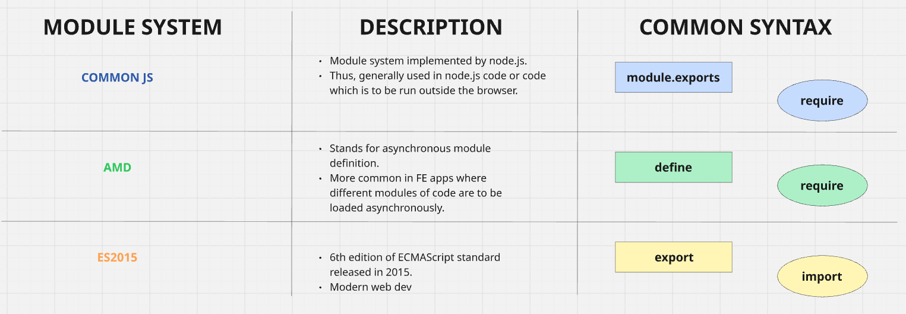

# WebpackStarter
A starter project to see webpack in action

1. Create a new npm project

        npm init
- Creates a project with only 1 file i.e package.json file.
- package.json files contains:
    - Dependencies used in our project
    - Scripts to build and execute our project

2. Create JS modules

- Create a `src` folder. This would segregate the core logic from other configuration/setup files.
- Create 2 JS files in that `src` folder: `index.js`, `sum.js`
- `index.js` will be using the functions from `sum.js` hence it is should be loaded first.
- Syntax to link JS files as per the module system:

    

3. Install and configure webpack

        npm install --save-dev webpack

- Install webpack for this project alone using the above command.
- Create a config file -> webpack.config.js 
    - File that lets us customize the behaviour of webpack
    - While running, webpack looks for a file with exact this name to fetch the custom configurations.
    - Webpack runs in node.js environment. Hence, we use a node.js helper function to fetch the absolute path for storing the output file.

4. Run webpack

- Create a script (build) in package.json file.
- Run this locally installed webpack

        npm run build

# Installing webpack globally: CONS

- Install using `npm install -g webpack`
    - Webpack gets installed globally on our system and is no longer confined to the current project.
- To run: `webpack`
    - Out of all the globally installed modules on our computer, the one called `webpack` will pe picked and run.
- However, when we install webpack just for a particular project and write a script to run it (as mentioned in the previous section), upon running that script:
    - Instead of checking the global node_modules directory our computer, npm will check the node_modules of our current project and run the `webpack` module present in it.
- When we install webpack globally, we can have only one version of it at a given time. If we want a project to be using webpack vX.0 and other one to be using vY.0, we should install it per project.
